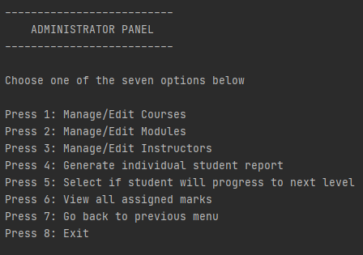

# Course-Management-System
A Course Management CLI Application with Java :100:

> Java | MySql + File Handling :ghost:

### Users of the system
* Administrator
* Students
* Instructor

### Key Roles :star:
  #### Administrator
  * Manage Courses and Modules [ Add | Delete | Temporarily Cancel ]
  * Manage Instructors details 
  * Assign Modules to instructor
  * Student Result Slip with grades for individual module
  #### Student
  * Choose Courses
  * View Module detail and assigned instructor 
  * Choose modules to enroll [ Mandatory | Optional ]
  #### Insructor
  * View Module details as well as enrolled students
  * Add marks to student's profile
  
### Some Project snapshots :cowboy_hat_face:

